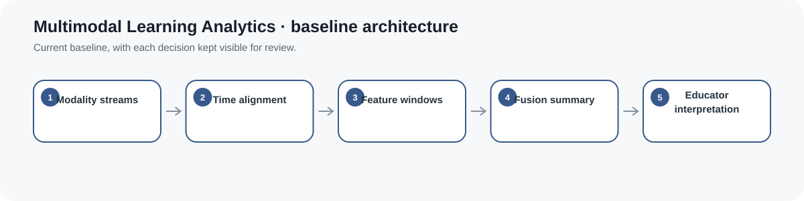
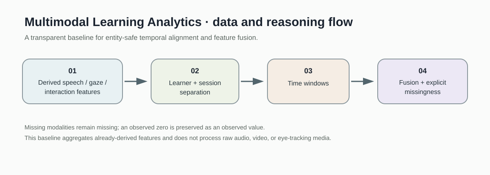
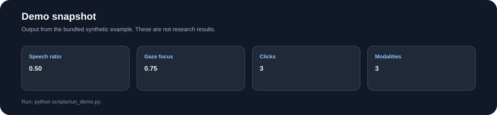
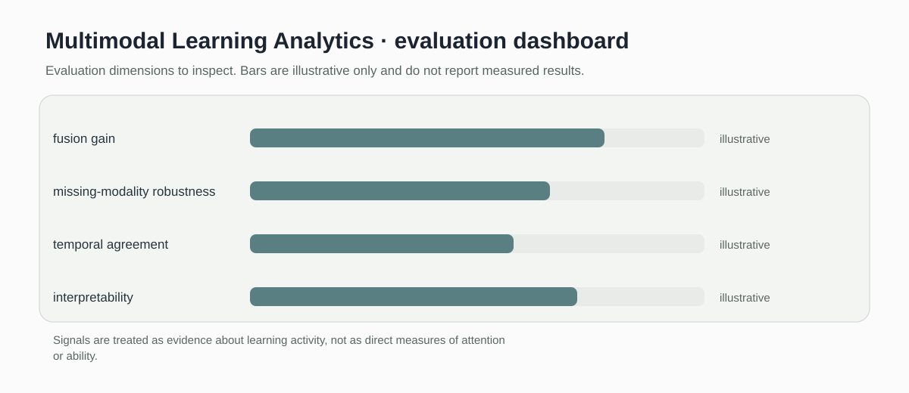

# Multimodal Learning Analytics

> Transparent windowed fusion for timestamped speech, gaze, and click features with explicit missing-modality handling.

[](https://github.com/devissaputra/multimodal_learning_analytics/actions/workflows/ci.yml)



**Area:** AI in Education (AIEd) · Multimodal Learning Analytics  
**Status:** working research prototype  
**Author:** Devis Wawan Saputra

## What this project is for

Learning-process data can contain several synchronized evidence streams. This repository provides a transparent baseline for grouping already-derived speech, gaze, and interaction features by learner and session, aligning them into fixed time windows, and fusing the available evidence without hiding missing modalities.

**Who may find it useful:** Researchers working on multimodal learning analytics, educational data mining, classroom analytics, and learning-process modeling.

## Questions answered by the current baseline

1. How can derived multimodal features be aligned in fixed windows without mixing learners or sessions?
2. How can available speech, gaze, and click features be fused transparently within a window?
3. How can missing modalities be handled without confusing absence with an observed zero?

## How it works

The baseline first keeps learners and sessions separate, then places timestamped events into fixed-width windows. Within each window it averages available speech and gaze features, sums observed click counts, records modality-specific presence flags, and reports how many modalities were observed.

An observed click count of zero remains a real observation. A missing click stream is returned as missing rather than being converted to zero.



The current implementation consumes already-derived numeric features. It does **not** process raw audio, video, or eye-tracking recordings.



This snapshot shows the bundled synthetic example. It verifies the software path; it is not an empirical performance result.

## Methods in the current baseline

- learner and session aware grouping
- fixed time windows
- timestamp alignment
- available signal averaging
- click aggregation
- explicit modality presence flags
- modality coverage count

## Data

The repository includes a small synthetic table of derived features only. No raw biometric media or identifiable learner data are distributed.

`data/README.md` documents the schema, missingness rules, learner/session boundaries, and conditions that should be recorded before real data are connected.

## Run the demo

```bash
git clone https://github.com/devissaputra/multimodal_learning_analytics.git
cd multimodal_learning_analytics
python scripts/run_demo.py
python -m unittest discover -s tests -v
```

The demo groups two synthetic events from learner `L01`, session `S01`, into the same time window and reports fused speech, gaze, click, presence, and modality-coverage values.

## API behavior

Use `window_events_by_entity()` when an event collection contains multiple learners or sessions. Its keys are `(learner, session, window_index)`.

Use `window_events()` only when the input has already been restricted to one learner-session sequence. If identity fields are present and more than one learner or session is detected, the function raises an error rather than silently pooling observations.

`fuse_window()` uses `None` for an unavailable modality and separate `*_observed` flags to distinguish missing data from observed values such as zero clicks.

## What to evaluate next

A useful next study should compare fused features with unimodal baselines under the same outcome definition and learner/session boundaries. Missing sensor periods, clock drift, feature-extraction error, window size, and modality dropout need explicit robustness checks.

## Evaluation view



The dashboard is an evaluation checklist rather than a result chart. Its bars are illustrative only and do not report measured performance.

## Limits and responsible use

Speech, gaze, and click features are behavioral signals, not direct measures of attention, understanding, emotion, engagement, or ability. Derived variables may also inherit errors and biases from upstream feature-extraction systems. The current code performs transparent aggregation only.

See `docs/ethics_and_risks.md` for the broader risk review.

## Repository map

```text
.
├── .github/workflows/ci.yml
├── assets/
│   ├── architecture.svg
│   ├── data_flow.svg
│   ├── demo_snapshot.svg
│   └── evaluation_dashboard.svg
├── data/
│   ├── README.md
│   └── sample.csv
├── docs/
│   ├── ethics_and_risks.md
│   ├── related_work.md
│   └── research_protocol.md
├── reports/model_card.md
├── scripts/run_demo.py
├── src/multimodal_learning_analytics/core.py
├── tests/test_core.py
├── .gitignore
├── CITATION.cff
├── LICENSE
├── pyproject.toml
└── README.md
```

## Research path

A credible next version would:

1. connect synchronized public or consented multimodal traces
2. document upstream feature extraction and synchronization quality
3. compare unimodal and fused baselines
4. stress-test missing channels, clock drift, and alternate window sizes
5. evaluate whether fusion adds useful information for a clearly defined learning-process outcome

More complex fusion models should come only after these transparent baselines are validated.

## Related work

`docs/related_work.md` points to open projects relevant to this problem area. They provide methodological context; this repository does not present their code or results as its own.

## Citation and license

`CITATION.cff` contains the software citation. The code and original SVG visuals use the MIT License. Any external dataset keeps its own license and usage conditions.
